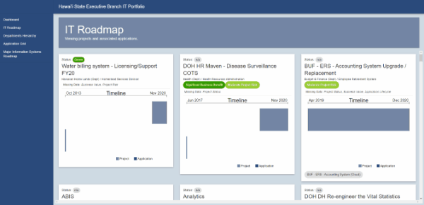
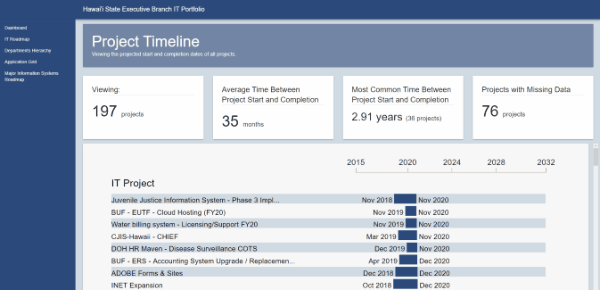
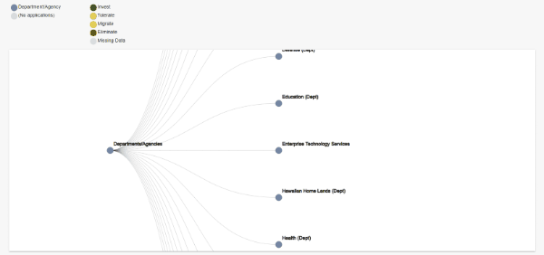
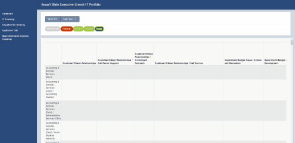
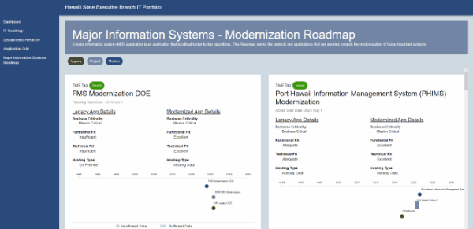

## The Hawai’i Annual Code Challenge

HACC 2020 is a yearly coding competition where contestants are invited to take part in creating innovating applications that benefit the problems surrounding Hawai’i. [Further information](https://hacc.hawaii.gov).

## The ETS ITS Portfolio Challenge

The challenge we chose to embark on was the State of Hawaii Executive Branch IT Portfolio & Roadmap Visualization. To give some background, the state of Hawai’i has a set of applications they implement, use, and are responsible for maintaining. Now, they already have software in use to keep track and visualize these applications. However, a lot of this data is sensitive and can only be viewed by employees of the state. Therefore, we had access to a subset of the actual data. Important data in this software includes information about an applications’ business capability, business criticality, functional fit, technical fit, and TIME recommendation. Instead of elaborating on this business-specific lingo, I will just say that basic gist of all these criteria is to determine where in its lifecycle an application is at. Even more simply: should we get rid of an application, is it good in its current state, or do we have to keep a lookout because it’s getting a little old? These are the types of questions that motivate software that is geared toward *Application Portfolio Management* (APM). Our job was to make one of those.

## Our Group and My Role

Our team name was the Crewmates, for the usual cringe reasons. We have me, Jan, as the group leader, Joshua Hartmann, and Jason Huang. 

As the group leader I undertook many responsibilities. I did not really know what I was doing, but I tried my best. I was in charge of meetings, the direction of our project, code review, delegating tasks, and lots and lots of coding. I wanted to unlock the potential of my group members and use them to the fullest of their abilities.

The tasks I delegated to Jason development-wise were more to do with the UI of our website. I discussed color schemes, layouts, and general design with him to make our site look good. He also took notes for us and did necessary paperwork.

Josh helped me out with the implementations of data visualizations. I also delegated paperwork and necessary submissions to him. Both group members had to keep track criteria and how we were meeting them.

## Our Project

The first part of this whole thing was making a group. I had asked two of my friends, also Computer Science majors to be in this with me. They were a little less experienced than me, but I wanted to give them the opportunity to learn with me, because I had never done a coding challenge before either.  They reluctantly agreed and thus our adventure began.

So how’d we choose our challenge? To be candid, I did not check out the HACC challenges before the start of the competition. That was probably my biggest mistake. The first time hearing of the challenges was the ZOOM call that kicked the competition off. After looking at the challenges I imagined what each challenge would require. Our decision to choose our specific challenge was based on our group size, skillsets, and time constraints. Some challenges seemed good for larger groups because of the breadth of functionality needed to implement. Others didn’t match our skillsets and, of course, we wanted to play to our strengths. So ultimately, the ETS ITS Portfolio Visualization challenge seemed the best for us because all of us knew React and we knew we all had experience in web development (Also React is my fav).

None of us had much experience in project management. We’ve only really read about it in our classes and maybe half-heartedly implemented some of their practices in past projects. Seeing as part of the criteria involved how we managed our project I felt it necessary to organize how we do development in some capacity.

First, we decided to use GitHub’s project management system that allowed us to use a Kanban board. We compartmentalized our tasks into tickets that belonged to lanes. We had four lanes: Backlog, To-Do, In Progress, and Completed. Pretty standard.

We would then have periodic meetings (every 2 or 3 days) to go through the project. We discussed what tickets should be added and where our application is going.

Next up was deciding how we code. Git is tricky and it definitely has a learning curve. So, I wanted to standardize how we make commits so as not to prevent merge conflicts and make everything nice and organized. So, from our Kanban board, we pulled tickets from our To-Do lane and created an issue on GitHub for them. They would then be transferred to the In Progress lane. Then, we would create a branch off the main branch with the name `issue-(issue #)` (Ex. issue-47). Once we were done, we created a pull request. The last step was code overview where I would look through the code and make suggestions or merge the commit to the main branch. The ticket would be transferred to the Completed lane. It would always be a nice dopamine hit.

Okay So what does our project even do?

We put effort into what we wanted our project to accomplish. The first goal was to make it user-friendly. I see all often websites or applications that just don’t seem to pay attention to affordance. It seems simple but it’s just as time-consuming as anything else in the development cycle. To accomplish this goal we looked at things such as colors used, simplicity, and layout. Our next goal was to create something that just looked modern. None of us are very artistic and the artistic design of websites, I feel, is a very overlooked aspect. Challenge-wise we wanted to fully make use of the data available to us possible. This involved, looking at the data and figuring out the best data visualizations to display. Our last main goal (there were many that directly corresponded to the criteria set) is to make the website as accessible as possible. This involves how users can view our project from different devices, including phones. So, one of the most irritating things was to make our website responsive to all devices using bootstrap. Another aspect of accessibility is making our website useable by those with disabilities.

### Dashboard

Users are first greeted with a dashboard with key visualizations of Hawai’i’s executive branch IT portfolio. An important distinction is established between the portfolio’s applications and projects. Applications are the program of group of programs owned and managed by a department that are used by employees or citizens. A project is an effort to create, modify, or maintain a specific application or service. As mentioned previously, applications have certain data fields. The same is true for projects. Both datasets also have lifecycle dates that are used to track what stage an application or project is in. With this in mind, we created various charts to visualize these data fields in order to draw key insights. These insights should answer questions such as “How many applications are projects are there?”, “Do a lot of applications need to be updated/removed?”, or “How much missing data is there?”.

### IT Roadmap

The next page guides users to the IT roadmap. A roadmap in the context of our application is a visualization of future applications and the projects that are responsible for transforming the current state into the road-mapped future state of applications. Here we can see visualizations about projects and their applications and where they lie in the timeline. This page also has a project and application timeline that displays all the applications and projects and their lifecycles.

### Departments Hierarchy

We are then guided to the Departments Hierarchy page. Here we can see an interactive dendrogram that shows the relationships between departments, sub-departments, and the applications associated with those departments.

### Application Grid

This page displays the application matrix. The top row corresponds to a business capability, simply defined as what an application is used for. The left column corresponds to an application’s department. The applications belong to the cells that corresponds to their specific department and business capability. Clicking on an application initiates a popover that displays more information about an application. The applications can also be color-coded by a specific category.

### Major Information Systems

Finally, we are brought to the Major Information Systems page. A major information system is just like any other application except it has more functionality and is much more important to the operations of a department. This page shows the projects and applications that are working towards the modernization of these systems.

## A Learning Experience

The HACC was a big endeavor for me. I learned a lot, made a lot of mistakes, and learned a lot about what to do and what not to do.

What went well/poorly is how much work I had to do. I knew beforehand that my group members were not going to be able to invest an absurd amount of time to this project and that I had to put in a lot of work. I was willing and ready. What I didn’t know was how much work actually involved. This resulted in me having to work on this like a full-time job if we were going to implement even a simple version of our application. Although this was tough on my brain, at least I know I can do it. Although I feel like I’ve coded several React projects, I still feel like I’ve learned a lot about not just React but programming in general. What is good versus bad code. What are good design practices. This also helps me in the future when I encounter the same problems. I also learned more about working in a team. It’s tough. What I hear too often is people hating being in a group or having to do group projects themselves. But that’s just what programming and development is. It’s always a collaborative effort. In the real world, you don’t know who you’re going to be working with, so you try your hardest to make things work. I chose my group based on the fact that we get along well. I didn’t pay too much attention to how “good” of a programmer someone is (whatever that means), because being able to work well with you group members is such an important thing to me. That does come with some caveats. In a perfect world, you group amazingly well together and everyone contributes their fair share of work. However, in our world, I still think we did well together and that my group members and I did good work.

Next time, I would change things such as group size and choosing a challenge. Our group all felt that if we had at least one more person we would benefit exponentially more. An extra person grants more perspective, opinions, and discussions in discussions, besides the obvious benefit of less workload for all of us. I would also use choose a challenge that tested more of my abilities. I tend to cater the projects I do to frameworks and languages that I’m comfortable in. I feel like I’ve reached a plateau in web development and I would prefer to get out of that comfort zone to make a more conducive environment for my learning. I think it’s good to challenge myself more.

Overall, HACC 2020 was a great experience and I was happy to broaden my skillset and knowledge of the problems concerning Hawai’i.

Here’s a [link](https://sharp-borg-ed125d.netlify.app) to the project. Here’s the ol’ [GitHub repository](https://github.com/HACC2020/Crewmates) and the [DevPost page](https://devpost.com/software/crewmates?ref_content=user-portfolio&ref_feature=in_progress).