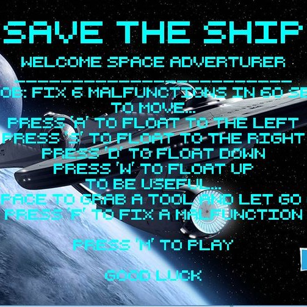
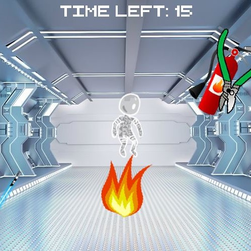

  
  

Delve into the realm of outer space and experience the isolation of captaining a failing ship overrun by aliens and major inconveniences. This 2d game involves the player simply acquiring the tools necessary to combat the attacking assailants and to fix the ship's deficiencies.

This project was my first team-oriented project as I embarked on my journey to become a software developer. Though the concepts involved are rudimentary, this project planted the seed that blossomed my curiosity to learning more about programming. I was involved in much of the design of this game as well as collaborating with my group members to come to agreements on how we wanted this game to come out. I feel it is important to acknowledge this project to look back on how I progress as a programmer.

